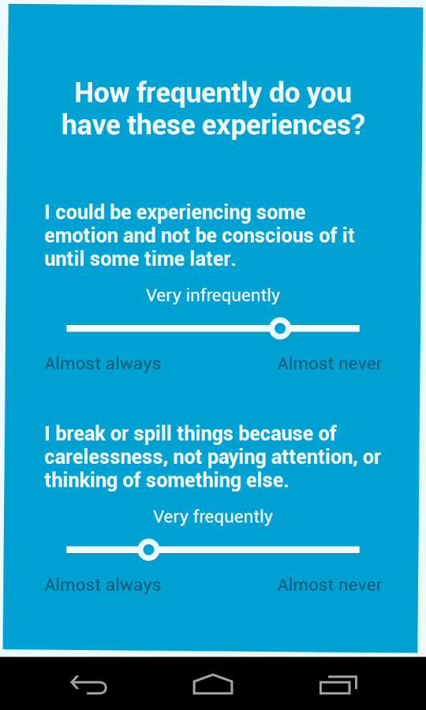
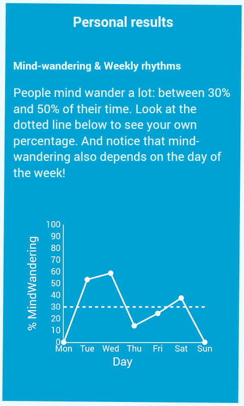
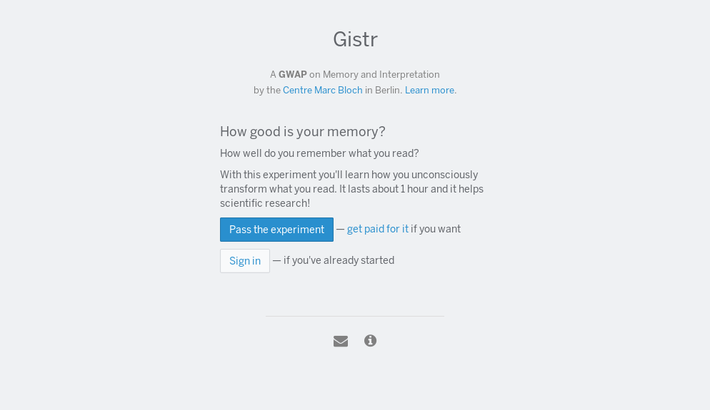
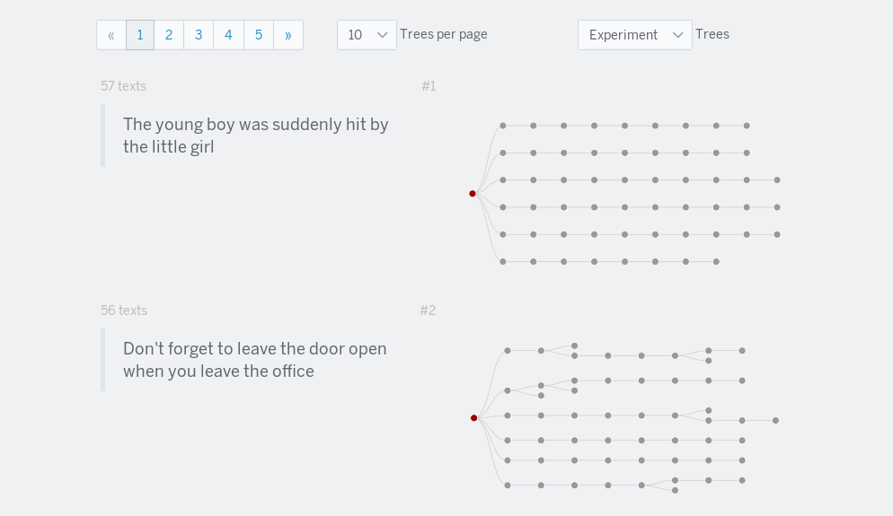

Introduction {-}
============

Studies of online interactions that are part of the "born-digital" sub-field of Digital Humanities usually focus on activities for which online records are readily available (mostly, blogs and large online social networks with varying degrees of access to the data).
In stark contrast to "in vitro" laboratory experiments, this "in vivo" approach studies human interactions in an ecological environment by analysing their digital traces.
^[I use the terms *in vivo* and *in vitro* in analogy to their meaning in biology.
As explained in the main text, *in vivo* refers to the study of human interactions in their ecological environment, be it through direct observation or through digital traces of those interactions.
*In vitro* refers to the study in conditions defined by the researcher, usually in a laboratory experiment.]

Yet despite the large amounts of data and computing power that this quantitative observation approach takes advantage of, it remains very difficult to ask questions linking cognitive and social levels of human interaction, and the revolution that was expected to happen in social science has yet to materialise.
More precisely: the question, both theoretical and experimental, of how to study and link together cognition and what social science defines as *social* proper, is still very much open.

Since better tools afford better questions and better theory, we focus here on the experimental side of this problem which is in fact quite simple:
online interaction studies are based on digital traces, but most researchers have no control over what data is recorded in those traces, or over the way the interaction is framed and defined by the technical system that mediates it.
As a result, only a very specific class of questions can be asked by online interaction studies: those that use only the available data and focus on the existing interaction framing, excluding any question for which some information is missing and not inferable or available elsewhere, as well as questions that need to tinker with the interaction framing.
The latter is a very high barrier to asking questions that link the cognitive and social levels of human interaction.

The purpose of this document is to briefly introduce the approach of Web and Smartphone experiments -- a promising method for human interaction experiments -- and the trade-offs it makes, and Gistr, the Web experiment I am currently developing as part of my PhD thesis to overcome the shortcomings of our previous study on sentence transformation in blogspace.

Web and Smartphone experiments
==============================

Complementary to studies using existing digital traces, Web and Smartphone experiments strike a different balance in the trade-offs of experimental work and seem very promising in addressing the problems outlined above [@miller_smartphone_2012].

Indeed, smartphones and browsers (both on desktop and mobile) have evolved into powerful, ubiquitous application environments for which one can relatively easily develop any kind of experiment involving text, graphics, and human interactions.
At the cost of higher engineering and recruitment efforts, this approach gives the experiment designer full control over what data is collected and the way interactions are framed.
Given the omnipresent nature of smartphones, such experiments can also be deeply embedded in everyday life which, as I explain below, opens even more possibilities for questions on social interaction.

The need for embedding
----------------------

Any quantitative study relies on abstracting out details of particular cases by reducing (most often averaging) values in each dimension to a few indicators.
Being able to render a precise view of the studied phenomenon then depends on being able to determine which are the right dimensions to describe it, and having access to them [@becker_epistemology_1996].

Embedding experiments in the everyday life of subjects gives access to dimensions that can be otherwise unavailable:
through the use of smartphones, an experiment designer can trigger interactions with subjects (for instance asking questions) at any moment of the day, or have measures running while subjects are offline (using the ever-increasing number of sensors present on the devices), both of which are impossible with digital traces.
Above all, embedding an experiment means getting greater access to context, which opens the possibility of understanding phenomena the way they are meant in the lives of subjects, and not only in the way they are construed by the experiment designer.

*Daydreaming* is an example experiment developed as a smartphone application with Vincent Adam, Mikaël Bastian, Jérôme Sackur, and Gislain Delaire, that took advantage of this embedding.
The experiment, focused on our awareness of daily mind-wandering, would probe subjects during a month at random moments of the day to ask them if they were mind-wandering (and, if so, what were the qualities of their thoughts).
^[See \url{http://daydreaming-the-app.net/} for more details.]
While our team spent over a year developing the application, it allowed asking questions related to ecological situations which cannot exist in laboratory or passive collection studies.
\autoref{f:dd-question} shows a sample question asked to the subjects, and \autoref{f:dd-results} shows an example of the results produced at the end of the experiment (this particular screen shows the results for one subject; seeing their own results was part of the reward for subjects participating in the study).

{width=35%}

{width=35%}

Pros and Cons
-------------

Experiments in the browser and on smartphones make specific trade-offs which differ from most other methods. The most important points are as follows.

**Pros**

* *Control*:
similar to laboratory experiments, complex designs are possible, and all the interactions the subjects can be involved in are defined by the experiment designer.
This includes for instance the way in which the experiment is framed (e.g. as a game or a self-improvement aid, aside from being a scientific study) and, more importantly, the ways in which subjects can interact with each other through the experiment.
* *Embedding*:
as explained above, smartphone-based experiments allow for real-life embedding:
the experiment designer can choose when and how interactions with the experiment and between subjects take place, and measure any number of variables the device gives them access to (geolocation, time, phone agitation through its accelerometers, general noise level, etc.), virtually at any moment.
* *Scale*:
if needed, the technical platform can relatively easily scale the number of subjects to several tens of thousands.
This also applies to interactions between subjects, which can directly involve many people, be it at the same time or (for instance) in chains.
* *Flexible recruitment*:
subject recruitment, while also a challenge (see *cons* below), is very flexible:
services like Prolific Academic
^[\url{https://www.prolific.ac/}]
let experiment designers recruit at reasonable costs in pools of tens of thousands of subjects with fine-grained demographic filters. Aiming for wider audiences can be done by offering rewards, framing the experiment as a self-improvement application, or turning it into a game.

**Cons**

* *Technical challenge*:
developing such an experiment involves a substantial amount of engineering and makes use of several technologies most researchers, even technical, are not familiar with.
While some all-in-one kits exist,
^[See e.g. \url{http://funf.org/} and \url{http://www.epicollect.net/}.]
creating an experiment that meets one's research often requires learning average skills in most of the various technologies at play:
a native or cross-platform smartphone environment, Web application development, backend server programming, and some server administration skills.
Most importantly, the paradigms and problems encountered are often new to researchers: most programming is asynchronous due to network communication or user interface, and technicalities such as user management or email validation can grow into real engineering challenges.
* *Spam-control*:
subjects are not constrained or encouraged by the face-to-face interaction of a laboratory experiment, neither are they (in most experiments) in the course of an interaction with friends where is it natural to them to not write spam, as can be the case in digital traces.
Participants must have an incentive to perform the experiment's tasks well.
If spam is naturally isolated in the experiment's design, one can for instance filter it once the data is collected and make payment depend on it prevalence.
But if spam propagates in the experiment, real anti-spam pressures and motivations need to be factored into the whole design.
* *Recruitment cost*:
while recruiting a few dozen or even a few hundred subjects is generally cheaper (not counting the cost of developing the experiment) than the equivalent for a laboratory experiment,
^[Global competition on online platforms like Prolific Academic drive subject payments down.]
and can be very easy for fast prototyping and pilots, recruitment cost rises linearly with the number of subjects and the time they spend on the experiment, unless a different strategy is used.
Turning an experiment into a playful application or an application useful to the user involves its own set of skills, can prove challenging, and must be factored into the development cost.

The Gistr Platform
==================

Rationale
---------

As part of my PhD thesis we are studying the transformation of short sentences -- such as quotations from politicians or spokespeople -- as they are propagated through various media.
Our first study focused on the evolution of such short quotations as they are copied from blog to media outlet to blog.
Indeed, authors often transform quotations when publishing them online despite the implicit and common-sense injunction to quote people verbatim: a few words disappear, a contraction appears, the quote is cropped, and so on and so forth [@simmons_memes_2011; @lauf_analyzing_2013].
Given this observation, the data collected by @leskovec_meme-tracking_2009 is at first sight a very good candidate to study the evolution of online content as it is transformed by users.
But the actual analysis proved itself much more challenging, for two fundamental reasons:

* *Missing information*: most blog and media outlet authors do not quote their source when they publish a quote online (it's often not relevant to the article), meaning there are no source-destination links in the data collected; this information must instead be inferred anew to study the evolution of content. There is also no access to author information (gender or age, experience in writing, but also psychological factors like memory span), ruling out any study of individual author effects in transforming the content.
* *Missing context*: the lack of access to the context of production and reception of quotes makes it impossible to interpret what a quotation means to its author or its reader [@wittgenstein_philosophical_2010; @briggs_mazes_1992; @cuffari_participatory_2014]. Analysing any kind of semantic evolution is therefore out of reach for this kind of passively collected online data [@lerique_2016, to be published].

The Gistr platform
^[As explained further down, we aim for a series of experiments based on the same paradigm and gradually introducing complexity to the problem.
Hence the term *platform*.]
emerged from a concern to address these two problems by taking advantage of the possibilities offered by Web experiments.
The general aim for this project is the study of interpretation and sense-making of short sentences in particular contexts, and the question of how interpretation and sense-making have global scale effects when accumulated and iterated.

State of the Art
----------------

This experiment aims to shed some light on the *cultural attractors* hypothesis presented by Dan Sperber in his work "Explaining culture: a naturalistic approach" [@sperber_explaining_1996].
Up to now Epidemiology of Representations, the theory behind the idea of cultural attractors, has mainly focused on the evolution of cultural bodily practices with long intergenerational lifecycles like religion [@boyer_religion_2001], smoking [@claidiere_role_2007], the way portraits are made [@morin_how_2013], and the practice of bloodletting [@miton_universal_2015].
The field has also started studies of diachronic evolution of language [@claidiere_cultural_2014].

Practices with short intragenerational lifecycles that have less to do with changes in bodily practice and more with interpretation have also been recently studied, like for instance music [@maccallum_evolution_2012] or risk perception [@moussaid_amplification_2015].

With the development of the Gistr platform, we aim to bring a new case in this area of short lifecycle opinion dynamics by studying the semantic evolution of short sentences and short stories in interpretation chains.
What change takes place here is mainly due to interpretation and the reconstructional component of memory which involves many levels and is influenced by many factors.
Therefore, after starting at the macro scale where individual variation and context details are abstracted out, we also aim to gradually move towards the mesoscopic scale, integrating more contextual and personal details and factors as the experiments are iterated.

General approach
----------------

Interpretation is currently at a theoretical crossroads between fodorian [@fodor_modularity_1983] and formal semantic analyses on one side, and enactive accounts of languaging on the other side [@cuffari_participatory_2014]. Epidemiology of Representations rests on the former: in this account of cognition and interpretation, the brain is a storehouse of representations and most of what interests us happens in that storehouse (perception, processing and transformation of representations).

During the 2000's however, a profound shift in philosophy of mind departed from this position and developed a theory positing the central role of the environment.
In this theory, cognition is seen as a way of exploring and relating to the environment (vs. storing representations of that environment), and as such cannot be considered out of or separated from it (some philosophers go so far as to consider that the environment is part of the cognitive device).
This line of thought has greatly improved the way cognitive science analyses contextual and situational information and interaction, has led to many experimental breakthroughs (mostly in perception; of particular interest are Sensory Substitution Devices [@oregan_sensorimotor_2001]), and has a number of implications for how perception and affect should be tackled (see for instance [@bower_bodily_2013]).

This approach, usually labelled "enactive",
^[The family of approaches developed following the shift in philosophy is also known as the "4Es": embodied, embedded, extended, and enactive cognition.]
construes interpretation as a kind of attention-perception-action loop that constitutes exploration of a meaningful environment through "educated attention" [@ingold_transmission_1997; @cuffari_participatory_2014].
While the enactive approach does bring an extremely promising conceptualisation of interpretation and how it can be studied, we chose to design the experiment following the paradigm of transmission chains which is a clear application of the more fodorian ideas behind Epidemiology of Representations.
This paradigm is also very analogous to real life situations of interest (such as the propagation of short sentences in blogspace) and, as we are currently seeing with the first results, is useful in pinpointing the shortcomings of the fodorian approach and highlighting the areas in particular need of an enactive approach to interpretation.

Other disciplines, such as Social Anthropology, oppose valuable criticisms to this design [see in particular @briggs_mazes_1992; @ingold_transmission_1997; @ingold_complementarity_1998; @ingold_beyond_2004].
However as explained above, the development will first focus on Epidemiology of Representations itself and, if time allows, gradually incorporate criticism as it serves the purpose of explaining the collected data and refining the conditions.
(The enactive critique will, for instance, prove useful in trying to develop conditions taking context and interaction into account, which in turn will likely allow us to explain some noise.)

Breakout and development
------------------------

Let us now present the current state of the experiment itself, and the directions we will develop it in.

### Breakout

In the first iteration we aimed to explore some interpretation effects, at the single and cumulative levels, in tasks involving sentence and story rewriting or reformulation.
Since interpretation involves so many levels of complexity, we started with the simplest possible condition (although it is probably underspecified), and will add new measures and conditions through further iterations, guided by the questions and the noise of the previous iteration.

To do this we built a Web experiment aimed at generating trees of short sentences that have been repeatedly memorised and rewritten (i.e. interpreted and reconstructed) by a large number of subjects. Recruited participants went through a series of steps:

* sign up (\autoref{f:gistr-welcome}),
* setting their mothertongue and answering a preliminary questionnaire (\autoref{f:gistr-questionnaire}),
* they then started training for the main task, consisting in repeatedly memorising and rewriting short sentences as accurately as possible. As the instructions show in \autoref{f:gistr-exp}, a sentence is presented to the subject, and after a short pause, the subject must rewrite the sentence as they remember it. The whole process loops until the experiment is finished. The real trials started after five training trials.

Once the subjects completed the experiment, the application switched to a game mode where each subject could suggest new sentences (depending on the number of sentences they have already transformed) that get fed to other game-mode subjects (thus keeping experiment and game sentences isolated).
Subjects could also explore the interpretation trees generated by the experiment and see how content was transformed along transmission chains (\autoref{f:gistr-trees}).

The initial sentences we selected consisted in quotations from the MemeTracker dataset [@leskovec_meme-tracking_2009], famous quotes obtained on WikiSource, and a few quotations from the 1957 film "12 Angry Men".
Each subject was presented either with original sentences, or with sentences further down a transmission chain, that is resulting from the iterated interpretation of other subjects.

**Measures**

In each iteration of the experiment, we will measure the following (among several other exploratory measures):

* Possible correlation between the transformation rate of sentences
^[Sentence *transformation rate* is measured by (1) extracting content words from the sentence by removing stopwords and lemmatising, (2) computing the content-word-based edit distance between the sentence and its parent, normalized to the maximum number of content words between the sentence and its parent.]
and age and gender of the authors,
* Cumulative transformation rate of sentences as a function of their depth in the tree,
* Transmissibility of sentences as defined by @claidiere_cultural_2014.

### Development

The experiment, freely accessible on \url{https://gistr.io/}, lets us start experimenting on paid (Prolific Academic) or volunteer (Crowd Crafting^[\url{http://crowdcrafting.org/}]) platforms, and later advertise for platform-free participation.

The technical development itself happens on the project's repositories, \url{https://github.com/interpretation-experiment/gistr-app/wiki}, and the scientific design and exploration is documented on the project's Open Science Framework repository, \url{https://osf.io/k7d38/}.
All the code written for this experiment (browser application, server backend, data analysis) is released as free software.

References
==========
